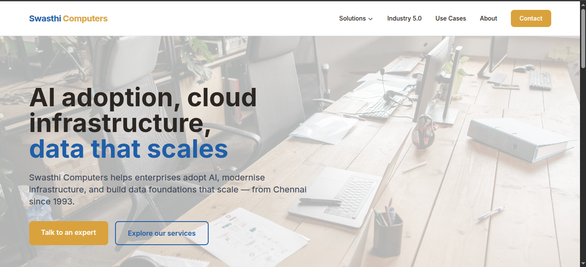

<div align="center">

# Swasthi Computers — Marketing Website

**Enterprise AI, cloud infrastructure, data that scales**  
A 6-page static marketing site for Swasthi Computers LLP — Chennai-based Microsoft Partner since 1993.

[](https://tailwindcss.com)
[](https://swasthicomputers.com)
[]()
[]()

➡️ **[View Live Site](http://localhost:8000)**

</div>

---

## 📖 The Story

Swasthi Computers has been delivering IT services from Chennai since 1993 — backend technical support, infrastructure management, and digital transformation. As a Microsoft Partner, they needed a website that reflects their repositioning toward Enterprise AI, Copilot deployment, Data Engineering, and Industry 5.0 — without losing the trust and stability that comes with 30 years in business.

The old site (if it existed) didn't communicate their modern AI capabilities. This build repositions them as a partner who can do both: keep your IT running *and* help you adopt AI safely.

Key design decisions:
- **Multi-page HTML** (no SPA) — each page has its own crawlable URL for SEO
- **Blue & white colour palette** — swasthi-blue (#0AA0E4) on clean white backgrounds
- **Mega-menu nav** — hero → "How we help" cards → CTA page rhythm
- **Deliverability tiers** — every capability tagged [Proven] / [Now] / [Aspire] so clients know what's ready and what's in development
- **No fabricated testimonials** — WindTrack is the only real proof point, everything else is transparent about readiness level
- **Scroll-triggered fade-in animations** — lightweight CSS + IntersectionObserver, no JS library

---

## ✨ Features

- **18 HTML pages**: Home page, 6 solution pages, Industry 5.0, Use Cases, About, Contact, 7 service catalogue PDFs
- **Hero background images** on all 6 solution pages using themed photography
- **WindTrack case study** — redesigned with gradient metric banner, tech tags, and live dashboard link
- **Microsoft industry scenarios** — 6 illustrative cards (Healthcare, Insurance, Banking, Professional Services, Manufacturing, Energy)
- **Service Catalogue PDFs** — 7 professional PDFs (6 per-solution + master), generated via ReportLab, downloadable with one click
- **Contact form** — sends to Formspree, with service of interest dropdown and async success/error states
- **Stats strip** — "By the Numbers" real-stat section on the Home page
- **Scroll-triggered fade-in animations** — lightweight CSS + IntersectionObserver
- **Scroll-to-top button** — appears after scrolling past the hero
- **Section background alternation** — white / gray-50 visual rhythm across all pages
- **Footer with Legal column + social icons** — LinkedIn, Twitter/X, Facebook
- **Fully responsive** — works on mobile, tablet, desktop
- **No backend, no build step** — pure static HTML + Tailwind CDN + vanilla JS

---

## 🛠️ Tech Stack

| Layer | Technology |
|---|---|
| **Markup** | Static HTML5 |
| **Styling** | Tailwind CSS (via CDN) |
| **Icons** | Heroicons (inline SVG) |
| **Fonts** | Inter (Google Fonts) |
| **Interactivity** | Vanilla JavaScript |
| **PDF Generation** | Python + ReportLab (`catalogue/generate_pdfs.py`) |
| **Forms** | Formspree (async POST) |
| **Hosting** | Ready for GitHub Pages / any static host |

---

## 📍 The Process

### Phase 1 — Scaffold
Set up the folder structure, base template with shared nav/footer, mobile responsive menu with accordion, and the colour system. Every page extends the same template.

### Phase 2 — Content Pages
Built the home page with pillar cards linking into the 4 strongest service areas. Each solution page follows the same rhythm: hero image → "How we help" cards with deliverability badges → CTA banner.

### Phase 3 — Industry 5.0 & Use Cases
Industry 5.0 page leads with predictive MRO as the narrative hook, backed by WindTrack screenshots. Use Cases page has the live WindTrack case study + 6 Microsoft industry scenario cards written in Swasthi's own voice (not Microsoft marketing copy).

### Phase 4 — Service Catalogue PDFs
Rather than a browser print-to-PDF approach, I wrote a Python script using ReportLab that generates A4 PDFs matching the exact professional style of an example PDF the client provided. Content is structured into PROVEN / NOW / ASPIRE tiers, same as the website. Running `python generate_pdfs.py` regenerates all 7.

### Phase 5 — QA
Every internal link was verified with curl. All 18 pages return 200. All image assets exist on disk. The `download` attribute was added to every PDF link so clicking triggers a native browser download.

### What I'd do differently
- The mega-menu and mobile nav are repeated verbatim in every HTML file — a partial template system (even a simple PHP include or a build step using `tmpl`) would reduce duplication
- The catalogue PDF generator could be extended to accept JSON input for easier content updates

---

## 📸 Preview



---

## 🚀 Running Locally

```bash
# Serve the static files
cd swasthi
python3 -m http.server 8000

# Regenerate PDFs (if ReportLab is available)
python3 catalogue/generate_pdfs.py
```

Then open [http://localhost:8000](http://localhost:8000).

---

<div align="center">

Built with care by Raj G.

</div>
